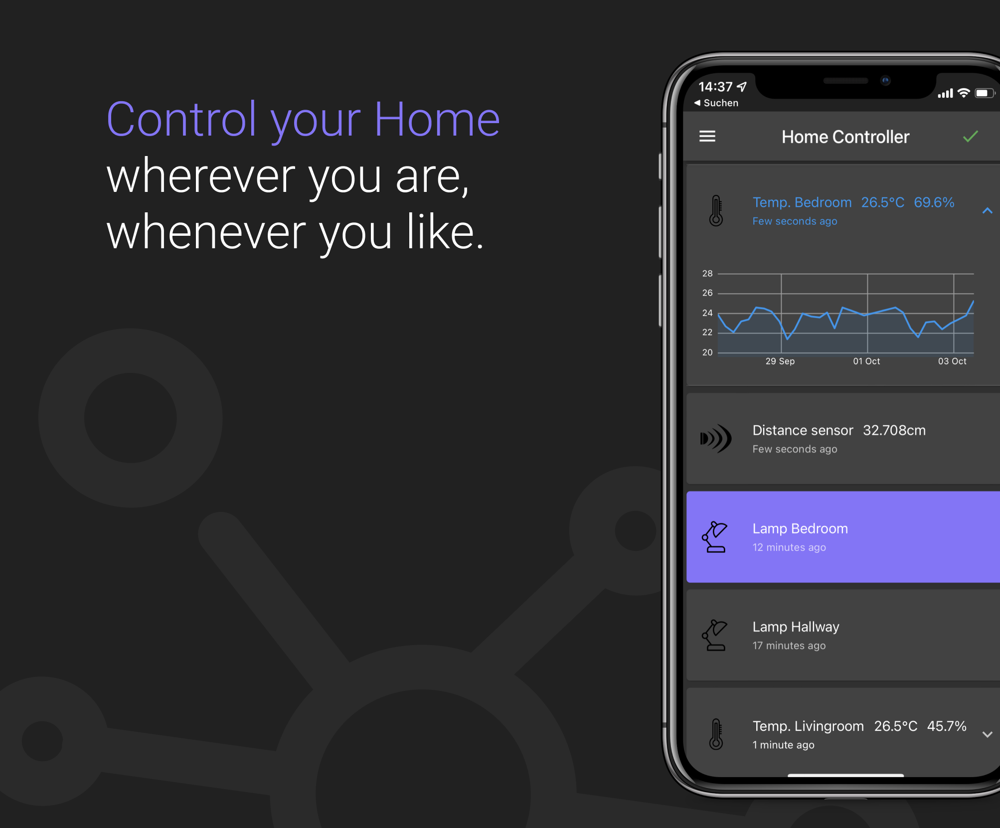
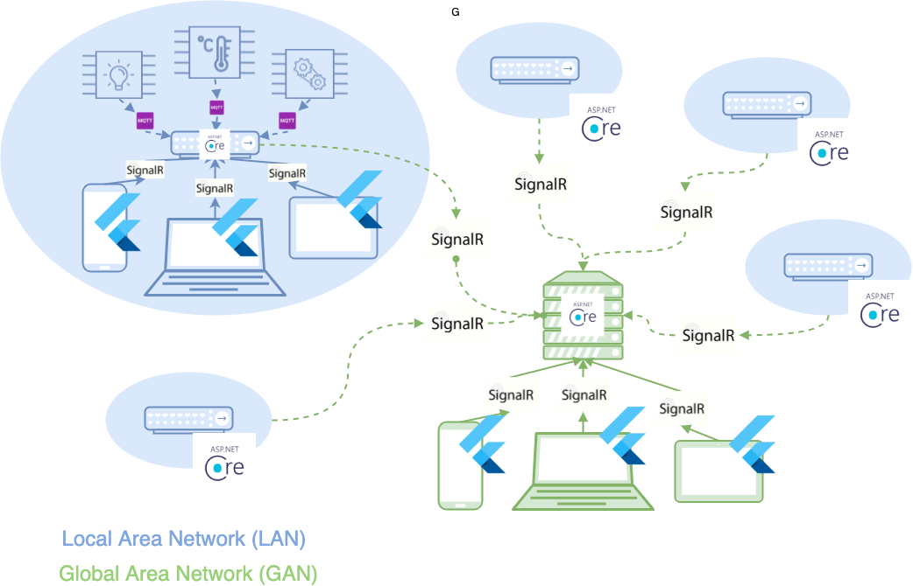

#  IoT Platform

>  An IoT platform that gives you control over you devices, wherever you are, whenever you like

## Multiplatform support

Supported client platforms are _iOS_, _Android_, _macOS_, _Web_.

## Platform Architecture + Used Frameworks

