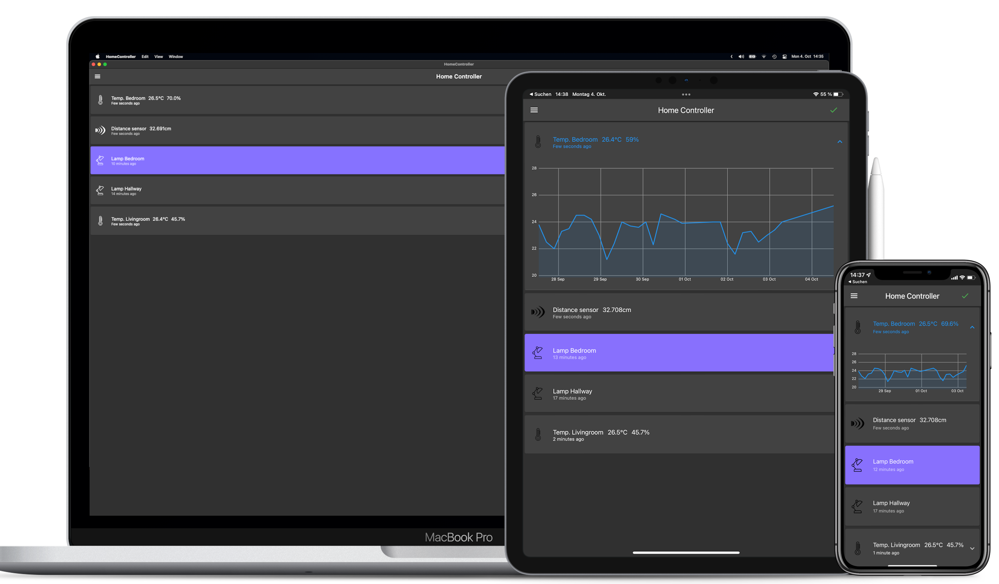

# IoT Client

Client application for the IoT platform. Currently supports the following platforms: _iOS_, _Android_, _macOS_, _Web_.

### Roadmap / Future plans

| Status | Goal                                                 |
| :----: | ---------------------------------------------------- |
|   ✅    | Provide basic realtime status of device states      |
|   ✅    | Support multiple device types                       |
|   ✅    | Connect dynamically to local or remote server       |
|   ✅    | Show device state history for thermometer devices   |
|   ⬜️    | Reorder devices based on activity / rooms / etc...  |
|   ⬜️    | ...                                                  |
